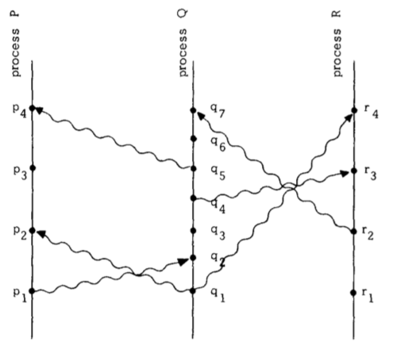
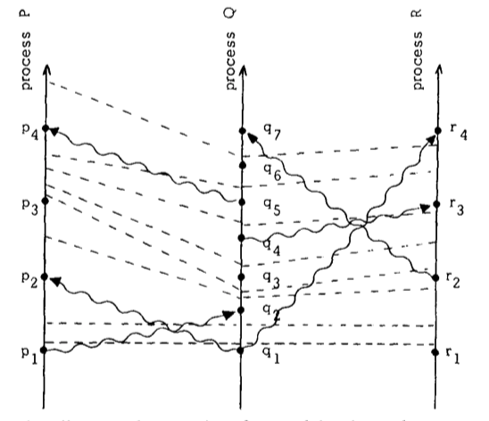
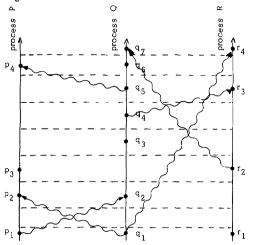

+++
template = "page.html"
date = "2021-04-06 21:31:59"
title = "【考古】【必读】分布式理论奠基paper"
[taxonomies]
tags = ["awesomepaper", "translate"]

[extra]
mermaid = true
usemathjax = true
+++
<!--
mermaid example:

    mermaid program

-->

原文标题：Time, Clocks, and the Ordering of Events in a Distributed System
原文作者：Leslie Lamport
[原文链接](https://lamport.azurewebsites.net/pubs/time-clocks.pdf)

译者声明：

本文中的进程（process）表示过程，不是典型意义上计算机的进程

偏序、局部顺序 partial ordering

## Abstract

在分布式系统中一个事件发生于另一个事件之前的概念需要被确定，定义为这两个事件的偏序(partial ordering)。给出一个分布式算法来同步系统的逻辑时钟，时钟可以用来全排序所有的事件。全序可以被用来解决事件同步问题。这个算法还被特化为解决同步物理时钟问题，可以容忍多长的时钟同步延迟。

## Introduction

时间是一个基本的概念。可以表示事件发生的顺序。我们说事件发生在 3:15 在时钟表示3:15，以及3:16之前。事件时间顺序的思考无处不在。比如，在航空公司预留系统中，我们声明在票买完之前，可以提供预留服务。与此同时，在考虑分布式系统中的事件时，我们必须慎重审视这个概念。

分布式系统中包含了一系列分离的进程，通过消息互通。网络连接起来的互联网（译者注：此处的互联网不是现在概念上的互联网，本文写于计算机组网早期，比如 ARPA网络系统）就是一个分布式系统。单独的一台计算也可以被看做分布式系统，其中中控单元，内存单元，I/O都是分离的进程。**如果消息的传递延迟相比于单个进程中的事件之间的事件是不能忽略的，我们就说系统是分布式的。**

我们主要考虑空间上分隔的计算机。然而，很多结论可以延伸到更广泛的其他系统中。尤其是，计算机上的多进程系统跟多个计算机组成的分布式系统本质上是相同的，因为都具备**事件发生顺序不可预测的特征。**

在分布式系统中，有时是说不清楚两个事件的哪个先发生的（译者注：物理时间意义的先）。因此"happened before"的关系实际上应该是两个事件局部顺序。这个问题经常被提出因为人们并没有仔细考虑其背后的意义。

本文中，我们就来讨论如何通过"happened before"关系定义局部顺序，然后给出一个算法来计算所有事件的全部顺序（全序）。这个算法可以提供一个有效的实现分布式系统的机制。我们可以看到通过这个算法的简单应用可以解决同步问题。如果通过该算法获得的排序与用户感知的排序不同，则可能发生非预期的动作。这可以通过引入一个真实的物理时钟来避免。我们同样提出了一个简单的方法来同步这些时钟，并且给出容忍的时钟漂移上限。

## The Partial Ordering 

大多数人可能这样描述事件a在事件b之前发生，如果a发生的时间早于b。这就是物理意义上的早于的定义。但是，如果系统有规范说明，应该通过规范说明来定义，如果规范中说明了根据物理时钟，系统必须包括物理时钟，然而，即使系统包含了物理时钟，也可能没有保持与真实事件的时间同步而发生错误。所以，"happened before"关系我们不用物理时钟来定义。

我们首先要将系统定义的更加精确。我们假定系统是由一系列进程构成。每个进程中包含了事件的序列。依赖于具体场景，一个进程中某个子函数的的执行可能是一个事件，或者一条机器指令的执行是一个事件。我们假定这些进程内的事件构成了一个序列，在进程内a发生于b之前。换句话说，一个进程定义了一个序列事件的全序。看起来事情已经解决了，甚至可以扩展定义将进程分离为子进程，但是我们不这样做。

我们假定发送或者接收消息是一个事件。通过"$\rightarrow$"定义"happened before"

*定义*. '$\rightarrow$' 是系统中事件的最小关系，满足以下三个条件：

1. 如果$a$和$b$是同一个进程中的事件，而且$a$发生于$b$之前，那么$a \rightarrow b$
2. 如果$a$是一个进程中发送消息，$b$是另一个进程中接收消息，那么$a \rightarrow b$
3. 如果$a \rightarrow b$并且$b \rightarrow c$，那么$a \rightarrow c$

两个事件$a$和 $b$，如果$a \nrightarrow b$，而且$b \nrightarrow a$，就说$a$和$b$是并发的。

对于任意事件$a$，$a \nrightarrow a$。这意味着$\rightarrow$就可以表示系统中所有事件的局部顺序。

图一

上图对于理解这个定义很有帮助。水平方向表示空间，垂直线表示时间---越高时间越靠后。点表示事件，垂直线表示进程，波浪线表示消息。很容易看出$a \rightarrow b$在图中意味着$a$可以将消息传递给$b$，比如 $q_1 \rightarrow r_4$

$a \rightarrow b$另一个定义是事件$a$可以影响到$b$。两个事件如果不能互相影响就是并发的。即使我们在图中看出$q_3$在物理时间上早于$p_3$，进程P不知道进程Q上发生了$q_3$事件，直到$p_4$收到消息（在$p_4$之前，P进程最多直到Q进程将要发生事件$q_3$）

This definition will appear quit natural to the reader familiar with the invariant space-time formulation of special relativity, as described for example in [1] or the first chapter of [2]. In relativity, the ordering of events is defined in terms of messages that could be sent. However, we have taken the more pragmatic approach of only considering messages that actually are sent. We should be able to determine if a system performed correctly by knowing only those events which did occur, without knowing which events could have occurred.【这一段不知道怎么翻译。】

## Logical Clocks

现在我们来将时钟引入系统。我们开始于很抽象的时钟概念，只用来对一个事件赋值一个数值，这个数值被用来表示事件发生的时间。更精确的，我们为每个进程$P_i$定义一个时钟$C_i$，函数$C_i \langle a \rangle$表示进程中事件$a$的数值。整个系统的时钟通过$C$表示，对于其中的事件$b$的数值使用$C \langle b \rangle$表示，当事件$b$属于进程$P_j$，$C\langle b \rangle = C_j\langle b \rangle$。现在，我们没有将$C_i \langle a \rangle$与物理时间绑定起来，所以我们可以将其看做是逻辑时钟而不是物理时钟。他可以使用计数器实现而不需要是时间机制。

现在我们考虑的意味着系统时钟是正确的。但是我们的定义不能基于物理时间，那样我们必须保证物理时钟。我们的目的是根据事件发生的顺序来定义。最强的合理条件是，如果事件$a$发生于事件$b$之前，我们使用下面的形式表示这种关系：

*Clock Condition*：对于任意事件$a, b$，如果 $a \rightarrow b$，则$C\langle a \rangle \lt C\langle b \rangle$。

现在这个条件不可逆，因为那意味着并发事件必须同时发生。在图一中我们看到$p_2,p_3$与$q_3$是并发的，但是这并不表示它们是同时发生的。

Clock Condtion（$\rightarrow$）满足如下条件：

1. 如果事件$a,b$都是进程$P_i$的，$a$早于$b$，那么$C_i\langle a \rangle \lt C_i\langle b \rangle$。
2. 如果事件$a$是进程$P_i$发送消息，$b$是进程$P_j$接收消息，那么$C_i\langle a \rangle \lt C_j\langle b \rangle$

通过tick可以将图一划线为图二，**条件一**意味着同一个进程的两个事件之间要有一条tick的线，**条件二**意味着消息传递线必然与一条tick线相交。我们可以调整图二，让tick线平行，重画为图三

图二

图三

读者可以发现，重画后的图三更清晰表明了各进程之间的事件先后关系。

让我们假定进程就是算法，每个事件是算法的执行命令。我们将阐述如何将时钟引入进程并且满足*Clock Condition*。进程$P_i$通过$C_i$来表示时钟。

为了满足*Clock Conditon*，条件一很容易，只需要满足以下规则

> IR1. 进程$P_i$在两个连续事件之间的$C_i$增长

为了满足条件二，我们要求消息$m$包含一个时间戳$T_m$，其等于消息发出的时间。在收到包含时间戳$T_m$的消息时，进程必须保证它的时钟大于$T_m$，更精确描述为下面的规则

> IR2. 
>
> 1. 如果事件$a$是进程$P_i$发送消息$m$，消息$m$包含时间戳$T_m = C_i\langle a \rangle$
> 2. 收到消息$m$的进程$P_j$设置$C_j$大于等于$T_m$

这样就可以确保系统的逻辑时钟是正确的。

## Ordering the Events Totally

现在我们可以使用满足*Cloud Conditon*的系统时钟来对系统的所有事件进行全排序。可以简单通过发生时间进行排序。为了避免混淆，我们使用符号$\prec$表示进程的顺序。为了更精确的定义，使用符号$\Rightarrow$表示：如果事件$a$在进程$P_i$中，事件$b$在进程$P_j$中，$a \Rightarrow b$当且仅当(i) $C_i\langle a \rangle < C_j\langle b \rangle$或者(ii) $C_i\langle a \rangle = C_j\langle b \rangle$ 并且 $P_i \prec P_j$。可以看出如果$a \rightarrow b$那么$a \Rightarrow b$。换句话说，符号$\Rightarrow$是偏序关系$\rightarrow$在全序中的表示。

$\Rightarrow$依赖于系统时钟，不是唯一的，不同的时钟选择会导致不同的$\Rightarrow$，而偏序关系$\rightarrow$由系统的事件唯一确定。

知道事件的全序关系对于实现分布式系统非常重要。事实上，实现系统正确的逻辑时钟就是为了获得这样事件的全序关系。全序关系可以解决下面的问题。**一个具有多进程的系统，单一的资源，同一时间只能有一个进程使用这单一资源，必须同步信息以免冲突**。我们希望找到一个算法分配这个资源满足三个条件

1. 一个获取这一资源的进程在另一进程获取前释放该资源
2. 不同进程的资源授权必须按照申请资源的顺序授权
3. 最后一个使用资源的进程释放了资源，以为着每个进程都使用了该资源

我们假定开始该资源被授权给了一个进程。

这是很自然的条件，并且描述了方案的正确性定义。但是条件二无法说明，并发的两个进程谁先获取资源。

要意识到这并非一个简单的问题。使用中心进程来按照接收顺序来授权资源是行不通的，除非有一些额外的假设。比如这种情况，$P_0$是调度进程，$P_1$向$P_0$发送了请求，然后向$P_2$发送了消息，$P_2$在没有收到的消息时，$P_2$也发送了请求到$P_0$。$P_2$的请求可以先到达$P_0$，如果先授权资源给了$P_2$，那么条件二不满足了。

为了解决这个问题，我们实现了规则IR1和IR2的系统时钟，然后使用这种时钟来对事件进行全排序。这就可以排序资源所有的请求和释放。有了全序，事情就迎刃而解。

为了简化系统，我们做了一些假设。这些并不是必须的，但是可以避免为了实现细节而分心。我们首先假设任何两个进程$P_i, P_j$，从$P_i$到$P_j$的消息

## Anomalous Behavior

## Physical Clocks

## Conslusion

定义了"happened before"的概念，偏序关系和全序关系。并且阐述了全序关系对于分布式系统的重要性，提出了逻辑时钟的算法

逻辑时钟有时是有问题的，可以通过引入物理时钟解决，并且物理时钟是可能漂移的

在分布式系统中，认识到事件之间的偏序关系是非常重要的。我们也认为这个idea在多进程系统同样重要。可以帮助人们理解多进程设计的基本问题，以及如何解决。

## Appendix 
略

## 参考文章：

1. https://lrita.github.io/2018/10/24/lamport-logical-clocks-vector-lock/
2. 狭义相对论与分布式系统中的时间  https://www.jianshu.com/p/0c79d650d13f
   1. 阐述了分布式系统中时间的本质，探索了分布式理论的本质
   2. 提出了Logical Clock算法，是后续Vector Clock，HLC(混合逻辑时钟，包含了logic clock, physical clock)等的基础
   3. 提出了Replicated State Machine的理念，是后续Paxos及其应用的基础
   4. 设计了无中心的分布式临界资源算法，是后续多种无中心分布式算法的鼻祖
   5. 设计了时间同步的雏形算法，后续NTP等的基础
3. 阿里数据库的HLC https://database.51cto.com/art/201911/606198.htm
4. https://lrita.github.io/2018/10/19/communication-model-in-distribution/
5. http://zhangtielei.com/posts/blog-distributed-causal-consistency.html 【推荐】

